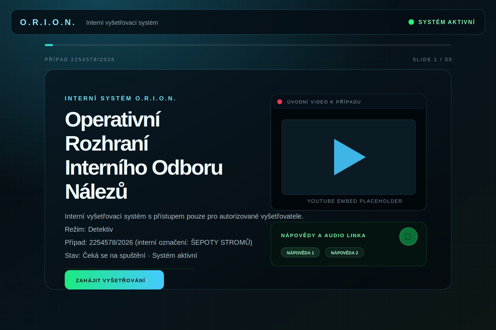

# O.R.I.O.N. — detektivní webová hra

Statická webová aplikace pro detektivní hru stylovaná jako moderní interní policejní databáze.

## Náhled přímo na GitHubu

Na GitHubu máš dvě rychlé možnosti:

1. Otevři soubor `README.md` v repozitáři. GitHub v něm automaticky zobrazí obrázek níže jako náhled úvodní obrazovky.
2. Pokud chceš otevřít jen samotný obrázek, klikni v seznamu souborů na `preview.svg`. GitHub SVG soubor vykreslí přímo v prohlížeči.



## Lokální spuštění interaktivní aplikace

Pokud chceš aplikaci opravdu proklikat, stáhni si repozitář a spusť:

```bash
npm start
```

Potom otevři v prohlížeči adresu:

```text
http://127.0.0.1:5173
```

## Veřejný náhled přes GitHub Pages

Chceš-li náhled sdílet přes odkaz bez lokálního spuštění, zapni GitHub Pages:

1. Na GitHubu otevři repozitář.
2. Jdi do `Settings` → `Pages`.
3. V části `Build and deployment` nastav `Source` na `Deploy from a branch`.
4. Vyber aktuální branch a složku `/ (root)`.
5. Ulož nastavení a počkej, než GitHub vygeneruje veřejnou URL.

Protože aplikace používá statické soubory `index.html`, `src/main.js` a `src/styles.css`, není potřeba žádný build krok pro GitHub Pages.

## Kontrola syntaxe

```bash
npm run build
```

## Když na GitHubu nevidíš žádné soubory

Pokud v GitHub repozitáři nevidíš `index.html`, `src/main.js`, `src/styles.css`, `preview.svg` ani `README.md`, změny pravděpodobně ještě nejsou nahrané na GitHubu nebo se díváš na jinou branch.

Zkontroluj hlavně:

1. Jestli je otevřená správná branch. Tato práce vznikla na aktuální pracovní větvi, ne nutně na `main`.
2. Jestli byl branch pushnutý na GitHub. Bez `git push` GitHub lokální commity neuvidí.
3. Jestli byl pull request mergnutý. Dokud PR není sloučený, soubory nemusí být vidět na hlavní větvi repozitáře.

Typický postup je:

```bash
git status
git branch --show-current
git push origin NAZEV_TVE_BRANCH
```

Po pushnutí otevři na GitHubu příslušnou branch nebo pull request. Teprve tam uvidíš přidané soubory a náhled.

## Oprava prázdné stránky na GitHub Pages

Aplikace musí na GitHub Pages používat relativní cesty k souborům. Proto `index.html` načítá stylesheet i JavaScript přes `./src/styles.css` a `./src/main.js`. Kdyby byly cesty zapsané jako `/src/main.js`, GitHub Pages by je hledal v kořeni domény místo ve složce repozitáře a stránka by zůstala prázdná.
